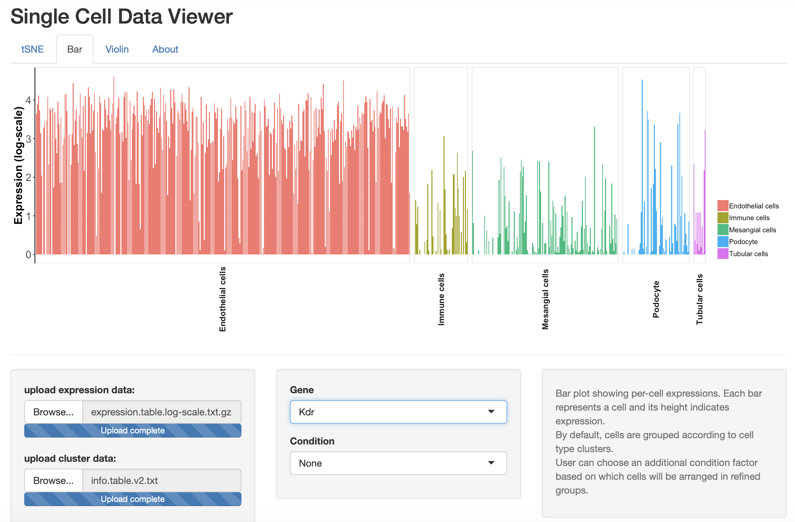
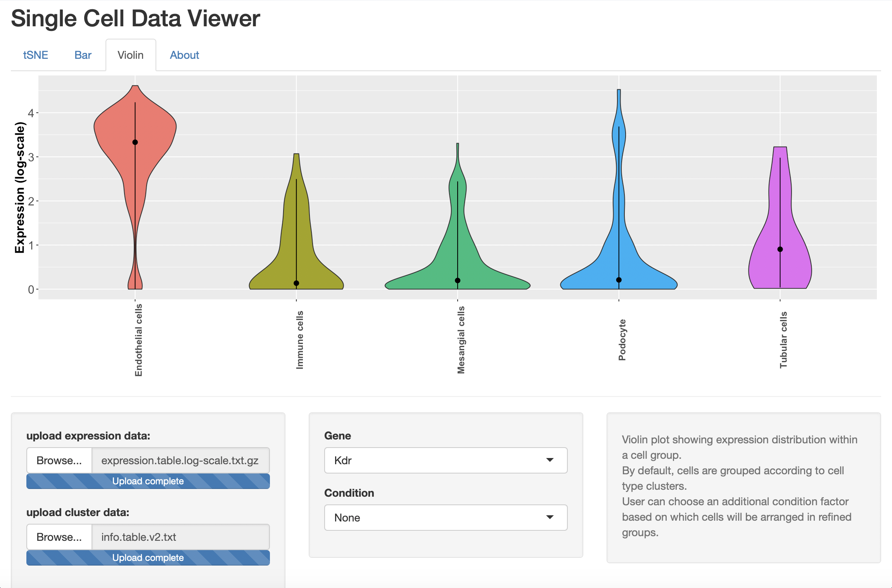

# SCViewer
####single cell data viewer

####developed using Shiny app.

###tSNE panel

t-SNE plots showing different types of cells (right), and highlighting expressions of a given gene (left).
User can choose a gene and show its expression in cells of a given cell type.

###Bar panel

Bar plot showing per-cell expressions. Each bar represents a cell and its height indicates expression.
By default, cells are grouped according to cell type clusters.
User can choose an additional condition factor based on which cells will be arranged in refined groups.

###Violin panel

Violin plot showing expression distribution within a cell group.
By default, cells are grouped according to cell type clusters.
User can choose an additional condition factor based on which cells will be arranged in refined groups.
